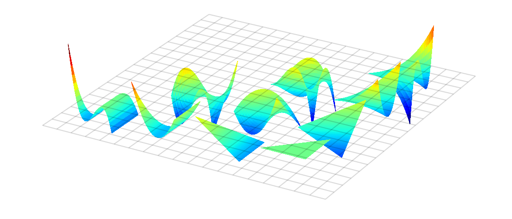

Welcome to modepy's documentation!
==================================

.. module:: modepy

:mod:`modepy` helps you create well-behaved high-order
discretizations on simplices (i.e. triangles and tetrahedra).
These are a key building block for high-order unstructured
discretizations, as often used in a finite element context.
It closely follows the approach taken in the book

  Hesthaven, Jan S., and Tim Warburton. "Nodal Discontinuous Galerkin Methods:
  Algorithms, Analysis, and Applications". 1st ed. Springer, 2007.
  `Book web page <http://nudg.org>`_

The basic objects that :mod:`modepy` manipulates are functions on a simplex.
For example, it supplies an orthonormal basis on triangles (shown here) and tetrahedra.

The file that created this plot is included in the :mod:`modepy` distribution
as :download:`examples/plot-basis.py <../examples/plot-basis.py>`.

Here's an idea of code that uses :mod:`modepy`:

.. literalinclude:: ../examples/derivative.py

This file is included in the :mod:`modepy` distribution as
:download:`examples/derivative.py <../examples/derivative.py>`.

modepy around the web
---------------------

* `Wiki home page <http://wiki.tiker.net/ModePy>`_
* `Source code <http://github.com/inducer/modepy>`_
* `Bug tracker <http://github.com/inducer/modepy/issues>`_
* `Package index <http://pypi.python.org/pypi/modepy>`_

Contents
========

.. toctree::
    :maxdepth: 2

    modes
    nodes
    quadrature
    tools
    misc

* :ref:`genindex`
* :ref:`modindex`

.. vim: sw=4
