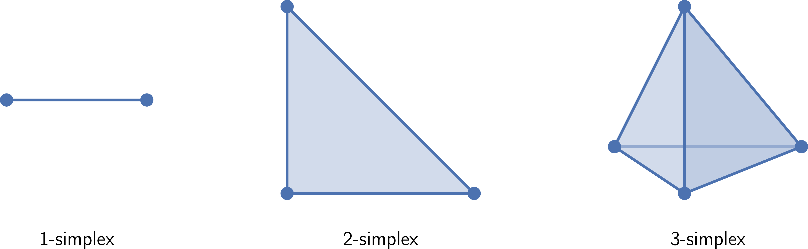
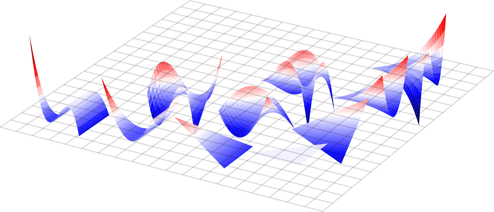
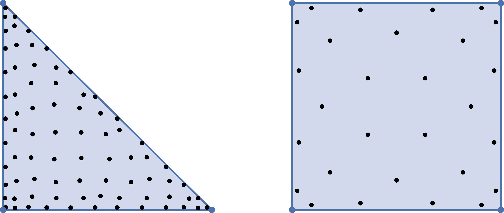

# Summary

`modepy` is a Python library for defining reference elements, equipping them with
appropriate approximation spaces, and numerically performing calculus operations
(derivatives, integrals) on those spaces. It is written in pure, type-annotated Python
3, offering comprehensive documentation and minimal runtime dependencies (mainly NumPy).

`modepy` focuses on high-order accuracy --- given an element size $h$, this refers
to the asymptotic decay of the approximation error as $O(h^n)$, for $n \ge 3$,
assuming sufficient smoothness of the solution being approximated. For a problem
in $d$ dimensions, the number of unknowns scales as $O(h^{-d})$. Therefore, if
accuracy is desired at manageable cost, high-order methods are crucial.

A popular approach for accurate approximation of functions on geometrically complex
domains is the use of *unstructured discretizations*, e.g. in the Finite Element
Method (FEM). The geometry is typically represented as a disjoint union (a "mesh") of
primitive geometric shapes, most often simplices and quadrilaterals. Given the means
to perform calculus operations on these *reference elements* and mapping functions
from them to the *global* elements, calculus operations become available on the entire
domain. These primitives are chiefly useful in the numerical solution of integral and
(partial) differential equations. Additional applications include computer graphics,
Computer Aided Design (CAD), and robotics. Those, in turn, can be used to model many
physical phenomena, including fluid flow, electromagnetism, and solid mechanics.
`modepy` has been used to construct FEM solvers [@Grudge; @PyNucleus] and integral
equation solvers [@Pytential] that run on both CPUs and GPUs.

# Statement of need

The functionality outlined above is often embedded in an ad-hoc manner in
larger codes, restricting scope and reusability. `modepy` addresses this
need by providing a reusable, generalizable, and composable implementation.

There are several other libraries in the literature with similar goals, but
important differences and limitations. FInAT [@FInAT] (and the earlier FIAT
[@FIAT]) offers reference elements and basis functions, but is tightly coupled
to the FEniCS/Firedrake ecosystem. Similarly, `StartUpDG.jl` [@StartUpDG] has a
focus on the needs of discontinuous Galerkin FEM in the Trixi framework. `QuadPy`
[@QuadPy] provides access to quadrature rules, but it is no longer open source
and lacks `modepy`'s composability. `minterpy` [@Wicaksono2025], meanwhile, deals
exclusively with polynomial interpolation, with a focus on sparse grids.

The solvers served by `modepy` typically have tight cost constraints, often adopting
HPC techniques (GPU, MPI, etc.). To facilitate separation of implementation and
high-performance concerns from the core numerical method, `modepy` adopts a two-pronged
approach. First, if it suffices to represent operations as data in matrix or tabular
form, execution of `modepy` code is not needed in a cost-constrained setting. For
example, nodes and bilinear forms on reference elements can generally be pre-computed
and tabulated. Second, if this tabulation approach falls short, `modepy` provides
data structures to reveal additional internal structure.

Tensor product elements provide an example of this. In this instance, many operator
matrices permit a Kronecker product factorization that significantly reduces the
asymptotic complexity of a matrix-vector product in higher dimensions [@Orszag1980].
`modepy` exposes functionality that allows reshaping degrees of freedom arrays to take
advantage of such factorizations. Another prominent example is the evaluation of basis
functions at points known only at runtime. To facilitate efficient evaluation, `modepy`
allows its functions to be "traced", in the sense of lazy or deferred evaluation.
The resulting expression graph is represented by the `pymbolic` [@Pymbolic] software
library, that can interoperate with Python ASTs [@Python_AST], SymPy [@SymPy], SymEngine
[@SymEngine], etc., for straightforward generation of high-performance code.

# Overview

The high-level concepts available in `modepy` are shapes (i.e. reference domains),
modes (i.e. the basis functions), and nodes (i.e. the degrees of freedom). These are
implemented in a user-extensible fashion using the `singledispatch` mechanism, with
inspiration taken from common idiomatic usage in Julia [@Bezanson2017].

## Shapes

The geometry of a reference element is described in `modepy` by the `Shape` class.
Built-in support exists for `Simplex` and `Hypercube` geometries, encompassing
the commonly used interval, triangle, tetrahedron, quadrilateral, and hexahedral
shapes (see \autoref{FigureSimplices}). `TensorProductShape` can be used to compose
additional shapes (e.g. prims, as generated by, e.g. `gmsh` [@Geuzaine2009]).

{#FigureSimplices width="80%"}

## Modes and Spaces

To perform calculus operations, each reference element can be equipped with a function
space described by the `FunctionSpace` class. These represent a finite-dimensional
space of functions $\phi_i: D \to \mathbb{R}$, where $D$ is the reference element
domain, and no specific choice of basis. Predefined choices include the `PN` space,
containing polynomials of total degree at most $N$, and the `QN` space, containing
polynomials of maximum degree at most $N$. As with shapes, these spaces can be
combined using `TensorProductSpace`. A `Basis` object is available separately,
giving access to basis functions and their derivatives, for, e.g., the monomials,
general Jacobi polynomials, and the Proriol-Koornwinder-Dubiner-Owens (PKDO) basis
from @Dubiner1991 (see \autoref{FigurePKDO}).

{#FigurePKDO width="80%"}

## Nodes

A final component in an FEM discretization [@Brenner2007, Section 3.1] is a set of
'degrees of freedom' ('DOFs') that uniquely identify a certain function in the span of
a basis. `modepy` supports modal DOFs (i.e. basis coefficients) and nodal DOFs (i.e.
function or derivative values at a point). On simplices, the "warp-and-blend" nodes
[@Warburton2007] are available, and on the hypercube, standard tensor product nodes
are constructed from one-dimensional Legendre-Gauss(-Lobatto) nodes. `modepy` can also
directly interoperate with the `recursivenodes` library described in @Isaac2020,
which offers additional well-conditioned nodes on the simplex.

## Quadrature

`modepy` also offers a wide array of quadrature rules that can be used on each reference
element. For the interval, Clenshaw--Curtis, Fejér, and Jacobi-Gauss(-Lobatto) are
provided. Many more state-of-the-art rules are available, typically up to high order
$n > 20$ from [@Grundmann1978;@Vioreanu2014;@Xiao2010;@Jaskowiec2021;@Witherden2015]
(see \autoref{FigureQuadrature}). There is also functionality [@Vioreanu2014] to allow
constructing novel quadratures on a given domain.

{#FigureQuadrature width="50%"}

## Matrices

`modepy`'s functionality is rounded out by various tabulation and matrix
generation functions. This includes the ability to tabulate operator matrices
for fairly general bilinear forms used in FEM.

# Acknowledgements

A. Fikl was supported by the Office of Naval Research (ONR) as part of the
Multidisciplinary University Research Initiatives (MURI) Program, under Grant
Number *N00014-16-1-2617*. A. Klöckner was supported by the US National Science
Foundation under award number DMS-2410943, and by the US Department of Energy
under award number DE-NA0003963.

# References
